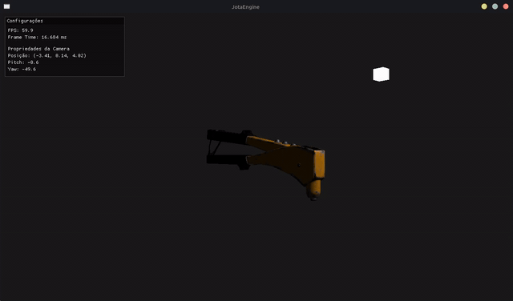

# JotaEngine


Uma engine de jogo 3D simples e poderosa, construída com C++ e a API gráfica OpenGL. O projeto tem como objetivo fornecer uma base para a criação de aplicações 3D e jogos, focando em um código limpo, modular e de fácil compreensão.

<p align="center">
  
</p>

## Funcionalidades

* **Renderização 3D:** Utiliza o poder do OpenGL moderno para renderizar cenas tridimensionais.
* **Controle de Câmera:** Sistema de câmera em primeira pessoa para navegação no espaço 3D.
* **Gerenciamento de Shaders:** Arquitetura para compilar, vincular e utilizar shaders (vertex e fragment) de forma simples.
* **Carregamento de Modelos:** Arquitetura usando Assimp para implementar modelos 3D facilmente..
* **Iluminação:** Iluminação Phong simples porém efetiva.
## Requisitos

* **[CMake](https://cmake.org/):** `versão 3.10` ou superior.
* **Compilador C++:** Um compilador C++ moderno que suporte C++17 ou superior (como `g++`).
* **[GLFW](https://www.glfw.org/):** A biblioteca GLFW precisa estar devidamente instalada e compilada no seu sistema.
* **[Assimp](https://github.com/assimp/assimp):** O Assimp precisa estar instalado, compilado e no seu **PATH** do sistema.
* **Editor de Código:** Um editor de sua preferência, como **Neovim** ou **Visual Studio Code**.

## Instalação

Siga os passos abaixo para compilar e executar um projeto de exemplo com a JotaEngine.

### 1. Clonar o Repositório

Primeiro, clone o repositório para a sua máquina local:

```sh
git clone https://github.com/JJ0o0/JotaEngine.git
```

### 2. Entrar na Pasta do Projeto

Navegue até o diretório que acabou de ser criado:

```sh
cd JotaEngine
```

### 3. Compilar e executar

Você pode compilar e executar o projeto de duas maneiras diferentes:

#### Método Simples (Recomendado)

Use o script (run.sh) para automatizar o processo de compilação.

```sh
./run.sh --release   # Para build com otimizações (versão final)
./run.sh --debug     # Para build com símbolos de debug (versão dev)
```
#### Método Manual

Se preferir fazer tudo manualmente, execute esses comandos:

```sh
mkdir -p build
cd build
cmake ..
make
cd ..
./build/bin/JotaEngine
```

No Windows, você pode usar o CMake com o generator do seu compilador:

**Para Visual Studio:**

```bash
cmake .. -G "Visual Studio 17 2022"
cmake --build . --config Release
```

**Para MinGW:**
```bash
cmake .. -G "MinGW Makefiles"
mingw32-make
```
## Licença

Este projeto está licenciado sob a licença [MIT](LICENSE).